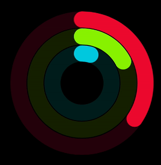
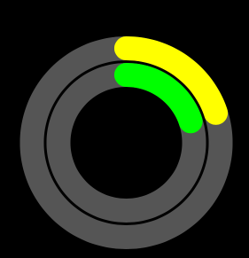

# ConcentricProgressRingView

[](https://travis-ci.org/Dan Loewenherz/ConcentricProgressRingView)
[](http://cocoapods.org/pods/ConcentricProgressRingView)
[](http://cocoapods.org/pods/ConcentricProgressRingView)
[](http://cocoapods.org/pods/ConcentricProgressRingView)



## Example

To run the example project, clone the repo, and run `pod install` from the Example directory first.

### Usage

At the top of your file, make sure to import "ConcentricProgressRingView"

```swift
import ConcentricProgressRingView
```

Then, instantiate ConcentricProgressRingView in your view controller:

```swift
func viewDidLoad() {
    super.viewDidLoad()

    let foregroundColor1 = UIColor.yellowColor()
    let backgroundColor1 = UIColor.darkGrayColor()
    let foregroundColor2 = UIColor.greenColor()
    let backgroundColor2 = UIColor.darkGrayColor()
    let initialProgress: CGFloat = 0.2

    let bars: [(UIColor, UIColor, CGFloat)] = [
      (foregroundColor1, backgroundColor1, initialProgress),
      (foregroundColor2, backgroundColor2, initialProgress),
    ]

    let width: CGFloat = 18
    let barMargin: CGFloat = 2
    let maxRadius: CGFloat = 80
    let ring = ConcentricProgressRingView(arcWidth: width, margin: barMargin, maxRadius: maxRadius, bars: bars)

    view.addSubview(ring)
}
```



You can customize the width, margin, and maxRadius parameters to customize everything to your liking. You can add as many bars as you want. Here's another example with 6 progress bars, with a smaller bar width, larger margin between bars, and a larger max radius:

```swift
let bars: [(UIColor, UIColor, CGFloat)] = [
    (foregroundColor1, backgroundColor1, initialProgress),
    (foregroundColor2, backgroundColor2, initialProgress),
    (foregroundColor1, backgroundColor2, initialProgress),
    (foregroundColor2, backgroundColor2, initialProgress),
    (foregroundColor1, backgroundColor2, initialProgress),
    (foregroundColor2, backgroundColor2, initialProgress),
]

let width: CGFloat = 8
let barMargin: CGFloat = 10
let maxRadius: CGFloat = 120
let ring = ConcentricProgressRingView(arcWidth: width, margin: barMargin, maxRadius: maxRadius, bars: bars)
```


### Animation

To animate a progress update, use the `set` method on `ring`. The following will update the second progress bar to 50% completion and will animate it over 2 seconds.

```swift
ring.arcs[1].set(0.5, duration: 2)
```

You can also use subscripts to access the individual arcs:

```swift
ring[1].set(0.5, duration: 2)
```

If you just want to change the progress, just set the progress on the ring, and it'll change it immediately.

```swift
ring[1].progress = 0.5
```

## Requirements

## Installation

ConcentricProgressRingView is available through [CocoaPods](http://cocoapods.org). To install
it, simply add the following line to your Podfile:

```ruby
pod "ConcentricProgressRingView"
```

## TODO

* [ ] Swift 3
* [ ] Documentation
* [ ] Tests

## Author

Dan Loewenherz, dan@lionheartsw.com

## License

ConcentricProgressRingView is available under the Apache 2.0 license. See the LICENSE file for more info.
